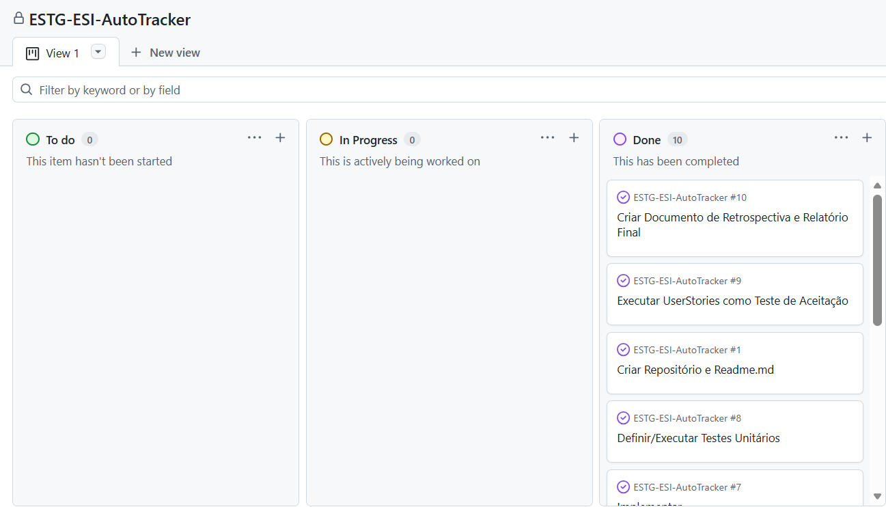
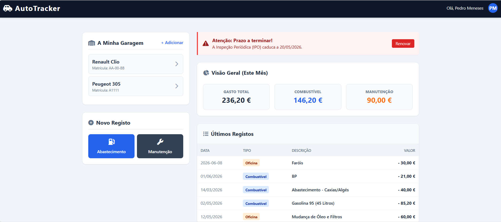
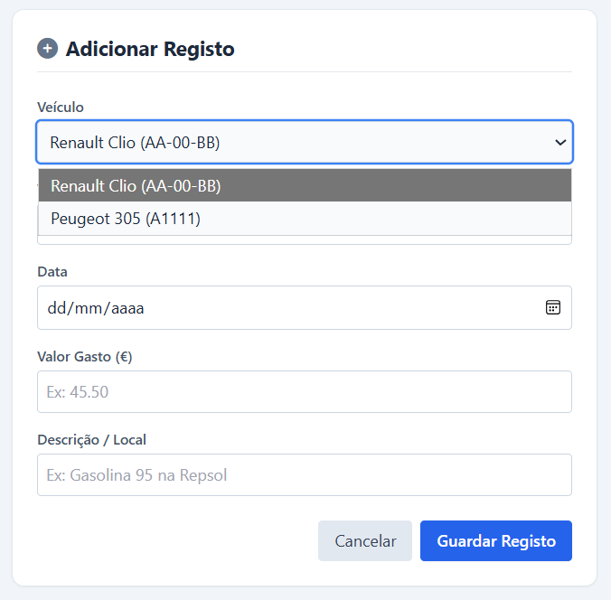
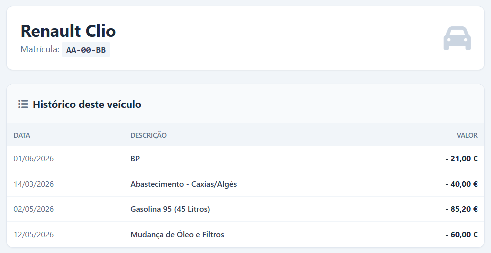
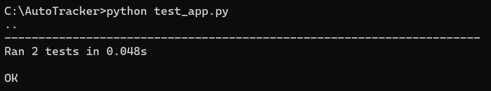

# Relatório Final e Retrospectiva - AutoTracker

**Disciplina:** Engenharia de Software I  
**Discente:** Pedro Meneses (Nº 60029)  
**Docente:** Toacy Oliveira  
**Projeto:** AutoTracker 

---

## 1. Introdução e Objetivos do Sistema

O presente documento contém o relatório Final e retrospetiva do desenvolvimento do sistema **AutoTracker**, criado e implementado no âmbito da disciplina de Engenharia de Software I. 

O objetivo principal do AutoTracker é resolver a separação e a falta de cuidado na gestão financeira e operacional de veículos de uso pessoal, ou até comercial. Ao invés de utilizar folhas de cálculo complexas ou notas manuais onde facilmente podemos cometer erros, o sistema oferece uma plataforma web integrada e intuitiva que centraliza:
* O controlo de despesas recorrentes (abastecimentos de combustível e intervenções mecânicas/manutenções).
* A monitorização de prazos legais e operacionais cruciais (Inspeção Periódica Obrigatória e Seguro Automóvel) através de um sistema proativo de alertas.
* Uma vista geral das métricas financeiras num painel analítico (Dashboard) em tempo real.

O foco do projeto foi a criação de um **Mínimo Produto Viável (MVP)** forte, estável e escalável, de forma a demonstrar a aplicação de boas práticas de engenharia durante todo o ciclo de desenvolvimento.

---

## 2. Ciclo de Vida e Metodologia de Desenvolvimento

Para garantir a organização e controlo do projeto face ao prazo de entrega, foi adotada uma metodologia ágil inspirada no método *Scrum/Kanban*. 

### 2.1. Gestão de Tarefas (Quadro Kanban)
O fluxo de trabalho foi integralmente mapeado utilizando a ferramenta **GitHub Projects**, através de um quadro Kanban composto por três colunas dinâmicas: *To do* (Por Fazer), *In Progress* (Em Progresso) e *Done* (Concluído). Esta ajuda visual permitiu monitorizar o progresso de cada etapa (desde a especificação inicial de requisitos até à validação final do código), de forma a não nos esquecer de etapas cruciais.

  
   <em>Figura 1: Fluxo de trabalho e gestão de tarefas no GitHub Projects.</em>

### 2.2. Requisitos Baseados em User Stories
Os requisitos funcionais foram registados sob a perspetiva do utilizador através de **User Stories** detalhadas. Cada história foi acompanhada pelos respetivos **Critérios de Aceitação**, servindo como um modelo para a fase de desenvolvimento do código e como guia para a fase de testes de aceitação. Isto garantiu que nenhuma funcionalidade fosse desenvolvida sem uma justificação de valor para o utilizador final.

---

## 3. Especificação e Modelação de Engenharia

A transição dos requisitos textuais para a arquitetura técnica foi feita em dois pilares formais de modelação UML (Unified Modeling Language).

### 3.1. Modelo de Casos de Uso (UML)
Foram mapeados 5 Casos de Uso (UC) principais que estruturam o comportamento do sistema:
1. **UC01 - Gerir Garagem:** Permitir a introdução e persistência de vários veículos (Matrícula, Marca, Modelo).
2. **UC02 - Registar Despesa:** Capturar entradas financeiras específicas (Combustível ou Oficina).
3. **UC03 - Consultar Histórico:** Disponibilizar uma tabela cronológica e transparente dos eventos.
4. **UC04 - Visualizar Alertas:** Apresentar de forma condicionada os prazos críticos de caducidade.
5. **UC05 - Dashboard Analítico:** Agregar valores e efetuar operações automáticos por categoria.

### 3.2. Modelo de Classes Relacional
O diagrama de classes UML (gerado via sintaxe *Mermaid* no repositório) estabeleceu a estrutura de dados relacional que serviu de fundação para a base de dados. A modelação garantiu a consistência relacional de **1 para muitos (1:*)** entre a entidade principal (`Veiculo`) e os detalhes (`Despesa` e `Alerta`), assegurando que cada gasto ou aviso está relacionado a uma viatura específica através de chaves estrangeiras (*Foreign Keys*).

---

## 4. Arquitetura de Software e Implementação Técnica

### 4.1. Opções Tecnológicas e Justificação
A arquitetura do AutoTracker segue o padrão clássico **Client-Server (Cliente-Servidor)** para aplicações web. Optou-se por uma combinação tecnológica focada na simplicidade, eficiência de execução local (*localhost*) e legibilidade de código:
* **Backend:** Desenvolvido em **Python** com a utilização do framework **Flask**. Esta opção justificou-se pela rapidez no mapeamento de rotas HTTP e pela facilidade de transição de conhecimentos de lógica estruturada para o ambiente web.
* **Base de Dados:** Foi utilizado o motor relacional **SQLite** através da biblioteca nativa `sqlite3`, por guardar os dados num único ficheiro local (`database.db`), elimininando assim a necessidade de configurações complexas de servidores externos (como MySQL), e garantindo total portabilidade do projeto.
* **Frontend:** Construído com **HTML5** e estilizado dinamicamente via **Tailwind CSS** (através de CDN) e ícones *FontAwesome*. A interface utiliza o motor de renderização **Jinja2** do Flask para injetar os dados da base de dados nas páginas de forma limpa e transparente.

### 4.2. Demonstração do Sistema em Funcionamento
O sistema foi testado com sucesso em ambiente local, apresentando uma navegação fluida entre ecrãs e cálculos matemáticos precisos no servidor.

  
   <em>Figura 2: Interface principal do AutoTracker com dados dinâmicos.</em>

  
   <em>Figura 3: Formulário de Novo Registo com dropdown dinâmica para seleção do veículo.</em>

  
   <em>Figura 4: Painel detalhado com o histórico isolado da viatura.</em>

---

## 5. Garantia de Qualidade e Gestão de Erros

Em conformidade com os rigorosos critérios de engenharia, o sistema foi dotado de mecanismos de proteção em camadas (Frontend e Backend).

### 5.1. Mitigação e Tratamento de Erros (*Edge Cases*)
O software foi pensado contra falhas comuns de preenchimento humano:
1. **Validação de Campos Obrigatórios:** Através do atributo `required` no HTML, bloqueia submissões em branco.
2. **Restrição de Tipos de Dados:** Utilização do tipo `date` (gerando um calendário nativo) para evitar datas inválidas em formato texto, e do tipo `number` para inputs financeiros.
3. **Robustez no Servidor:** Implementação de blocos `try...except` no Flask. Caso um utilizador tente injetar dados corrompidos ou ocorra uma falha inesperada no motor SQLite, o Python captura a exceção (`ValueError` ou `sqlite3.Error`), impede o colapso (*crash*) do servidor e devolve uma resposta HTTP controlada com o código de erro adequado (400 ou 500).

### 5.2. Testes Unitários Automatizados
Para além das validações manuais, foram desenvolvidos testes automatizados recorrendo à biblioteca **`unittest`** do Python. O script `test_app.py` simula um cliente web de teste, verifica o comportamento das rotas principais (`/` e `/novo_registo`) e valida se o servidor responde com o código `200 OK` e com o conteúdo HTML esperado.

  
   <em>Figura 5: Execução com sucesso dos testes automatizados no terminal.</em>

---

## 6. Retrospectiva do Projeto

O desenvolvimento do AutoTracker simbolizou uma excelente oportunidade para aplicar metodologias estruturadas de engenharia a um problema prático, com possibilidade de uso futuro.

### 6.1. O que Correu Bem
* **Evolução Gradual e Segura:** A estratégia de criar primeiro um mock estático em HTML/Tailwind permitiu fechar o design visual rapidamente, servindo de base visual estável para acoplar o backend em Python sem sobressaltos.
* **Consistência Documental:** O planeamento prévio dos Casos de Uso e do Diagrama de Classes UML evitou retrabalho na fase de programação. A estrutura física da base de dados espelhou perfeitamente o modelo concetual.
* **Implementação de Fluxos Avançados:** A inclusão de uma dropdown dinâmica no formulário e de rotas parametrizadas (ex: `/veiculo/<id>`) elevou o nível técnico do MVP, garantindo um comportamento relacional verdadeiro.

### 6.2. Desafios e Dificuldades Superadas
* **Gestão de Prazos:** O calendário exigiu foco absoluto nas funcionalidades nucleares (*Core Features*). A possibilidade de adicionar funcionalidades secundárias foi deixada para segundo plano, devido ao quadro Kanban.
* **Conversão de Tipos de Dados:** Lidar com a formatação de números decimais (substituição de vírgulas por pontos para operações em *float*), a formatação de strings de datas, e os erros humanos exigiu uma atenção redobrada no processamento dos dados recebidos via formulário POST no Flask.

### 6.3. Lições Aprendidas
* A modelação detalhada não é uma perda de tempo, mas sim um acelerador de escrita de código.
* Desenvolver software com foco em testes unitários e tratamento de exceções desde o início reduz drasticamente o tempo gasto em depuração (*debugging*) numa fase avançada.

---

## 7. Conclusão e Trabalho Futuro

O AutoTracker cumpre com distinção todos os requisitos técnicos estabelecidos para a disciplina de Engenharia de Software I. O produto final é uma aplicação web funcional, limpa, estruturada sobre uma base de dados relacional e devidamente testada.

Como perspetivas de evolução e **Trabalho Futuro** para o sistema, identificam-se os seguintes pontos:
1. **Autenticação de Utilizadores:** Implementar um sistema de controlo de acessos (*Login/Registo*) com hashing de passwords para tornar a aplicação multi-utilizador e segura, e com possibilidade de integrar a conta Google.
2. **Integração com LLM Local (Inteligência Artificial):** Conforme delineado como opcional no Documento de Visão, integrar um modelo de linguagem local (via *Ollama*) capaz de processar fotografias de faturas mecânicas em formato PDF/PNG, extraindo e preenchendo automaticamente o valor, a data e a descrição no formulário do AutoTracker.
3. **Exportação de Dados Prática:** Desenvolver a funcionalidade real do botão "Exportar para Excel", gerando ficheiros `.xlsx` formatados com o histórico financeiro do veículo utilizando a biblioteca `openpyxl`.

---
*Fim do Documento.*
